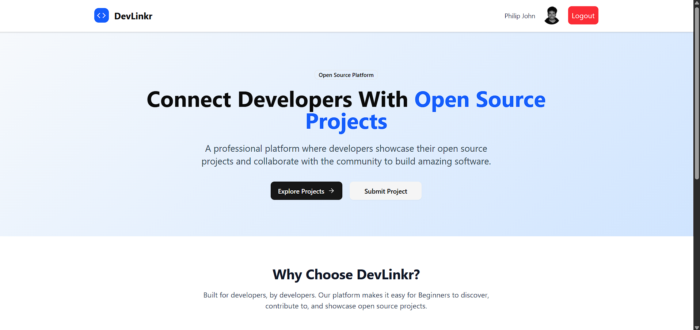
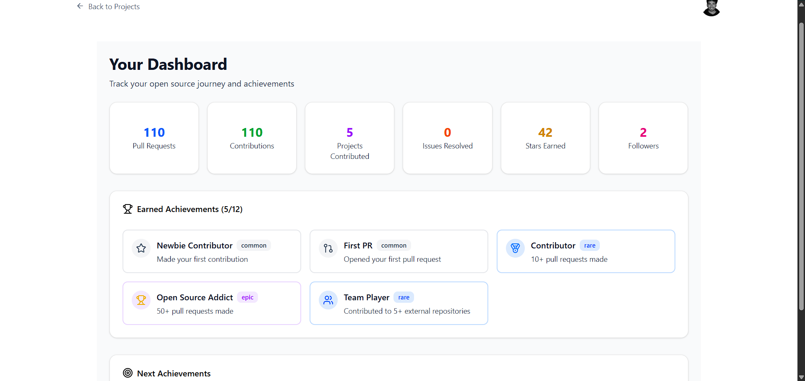
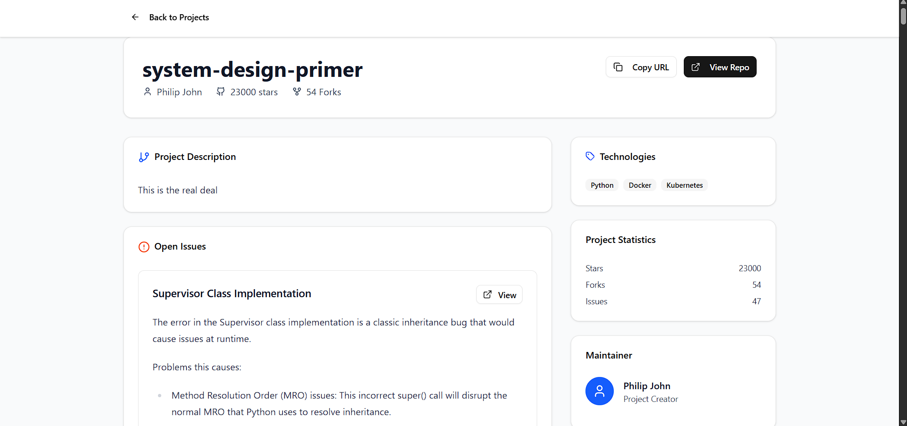
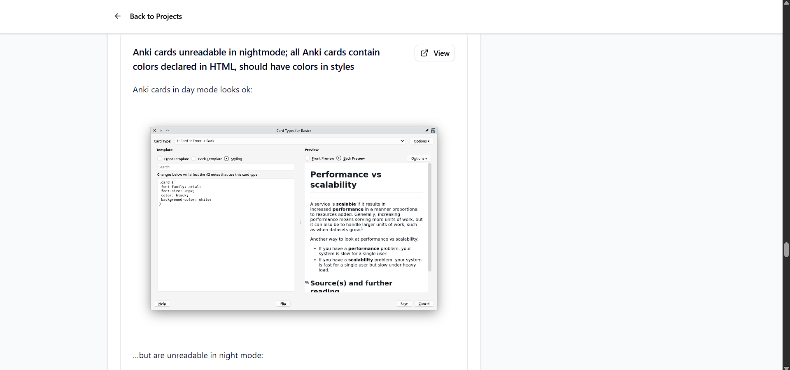
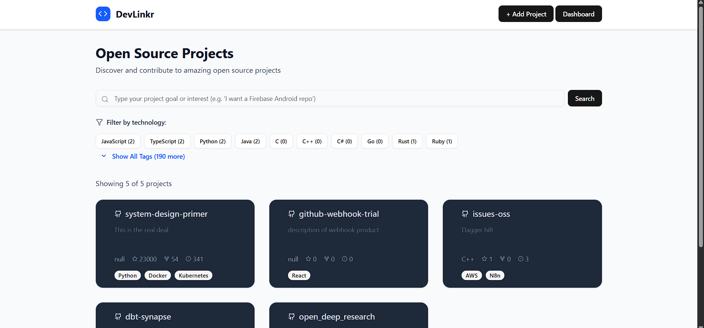
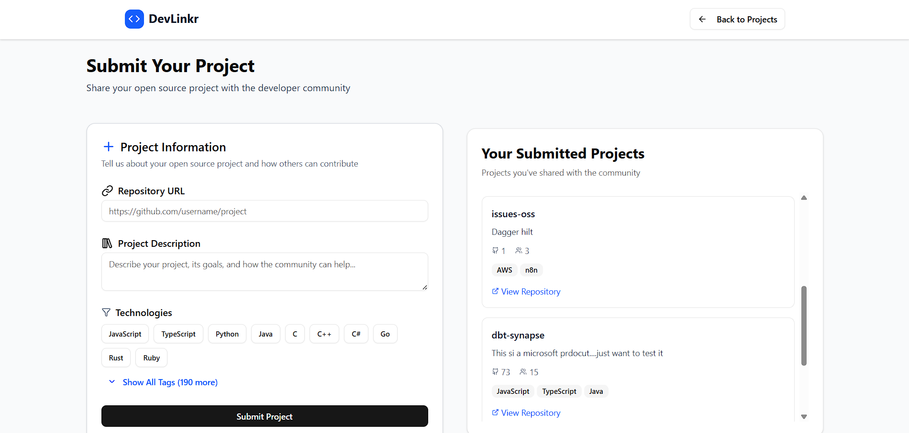
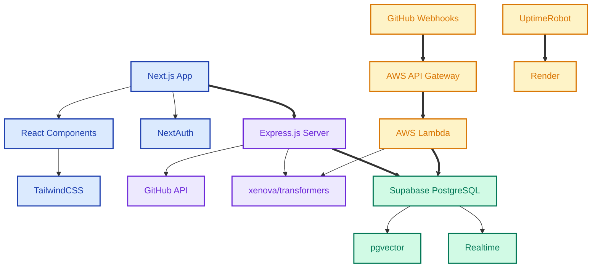

# 🌟 DevLinkr

<div align="center">


**🚀 Simplifying Open Source Contribution for Absolute Beginners**

*A secure full-stack web app that makes your first open source contribution accessible and rewarding*

[](https://nextjs.org/)
[](https://reactjs.org/)
[](https://www.typescriptlang.org/)
[](https://supabase.com/)
[](https://aws.amazon.com/)

</div>

---

## 🎯 What is DevLinkr?

DevLinkr is a full-stack web platform designed to bridge the gap between eager new contributors and open source projects that need help. We've built a secure, feature-rich application that transforms the intimidating world of open source into an engaging, achievement-filled journey.

## ✨ Key Features

### 🔐 **Secure Authentication System**
- **GitHub OAuth integration** for seamless login
- **JWT-based authentication** with secure session management
- Streamlined user experience with familiar GitHub credentials

### 📊 **Interactive Dashboard**
- **Comprehensive stat tracking** for user contributions
- **Achievement system** to gamify the contribution experience

### ⚡ **Real-Time Issue Synchronization**
- **Supabase Realtime** integration for live issue updates
- **GitHub webhook processing** with ~2.8s average end-to-end time

### 🧠 **Intelligent Search & Discovery**
- **Semantic search** powered by vector embeddings
- **@xenova/transformers** for embedding generation
- **pgvector** integration for efficient similarity matching
- **Tag-based filtering** for precise issue discovery

### ☁️ **Robust Cloud Architecture**
- **AWS API Gateway** + **AWS Lambda** for webhook processing
- **Render hosting** with UptimeRobot cron jobs for reliability
- **Vercel deployment** for optimal frontend performance

---

## 🖼️ Application Screenshots

<details>
<summary>🏠 <strong>Landing Page</strong></summary>



*Clean, welcoming interface that immediately communicates the platform's value*

</details>

<details>
<summary>📊 <strong>Dashboard</strong></summary>



*Comprehensive overview of user stats, achievements, and contribution tracking*

</details>

<details>
<summary>🔍 <strong>Issue Discovery</strong></summary>




*List of all the issues of that repo*

</details>

<details>
<summary>🌱 <strong>The Yard</strong></summary>



*Lists all the projects that need contributions integrated with search and filtering capabilities for finding the perfect issues/repos*

</details>

<details>
<summary>🆘 <strong>Help Request System</strong></summary>



*Streamlined process for submitting projects*

</details>

---

## 🏗️ Technical Architecture

### Performance Metrics

| Metric | Value | Description |
|--------|-------|-------------|
| **Webhook Processing** | ~2.8s | End-to-end GitHub event to database update |



---

## 🛠️ Tech Stack

### Frontend
- **Next.js 15.3.3** - React framework with SSR capabilities
- **React 19.0.0** - Modern UI library with latest features
- **TailwindCSS 4** - Utility-first CSS framework
- **Lucide React** - Consistent icon system

### Authentication & Security
- **NextAuth 5.0.0-beta.28** - Comprehensive authentication solution
- **GitHub OAuth** - Seamless integration with developer workflows
- **JWT (jsonwebtoken 9.0.2)** - Secure token-based authentication

### Backend & API
- **Node.js** - JavaScript runtime environment
- **Express.js 5.1.0** - Web application framework
- **TypeScript 5.8.3** - Type-safe development experience

### Database & Real-time
- **Supabase** - PostgreSQL with real-time capabilities
- **pgvector** - Vector similarity search
- **Supabase Realtime** - Live data synchronization

### AI & Search
- **@xenova/transformers 2.17.2** - Client-side machine learning
- **Vector embeddings** - Semantic search capabilities

### Cloud Infrastructure
- **Vercel** - Frontend hosting and deployment
- **Render** - Backend API hosting
- **AWS API Gateway** - Webhook endpoint management
- **AWS Lambda** - Serverless function execution
- **UptimeRobot** - Service monitoring and uptime management

### Development Tools
- **TypeScript** - Static type checking
- **Concurrently** - Parallel script execution
- **ts-node** - TypeScript execution environment

---

## 🚀 Getting Started

### Prerequisites

```bash
node >= 18.0.0
npm >= 8.0.0
```

### Installation

```bash
# Clone the repository
git clone https://github.com/yourusername/devlinkr.git
cd devlinkr

# Install dependencies
npm install
```

### Development Scripts

```bash
# Be sure to make your server and change the frontend to point to that server 

# Start frontend only
npm run dev

# Start backend only  
npm run server

# Start both frontend and backend concurrently
npm run dev:fullstack

# Build for production
npm run build

# Start production server
npm run start

# Run linting
npm run lint
```

### Environment Setup

Create a `.env.local` file with your configuration:

```env
# GitHub OAuth
GITHUB_ID=your_github_client_id
GITHUB_SECRET=your_github_client_secret

# NextAuth
NEXTAUTH_URL=http://localhost:3000
NEXTAUTH_SECRET=your_nextauth_secret

# Supabase
NEXT_PUBLIC_SUPABASE_URL=your_supabase_url
NEXT_PUBLIC_SUPABASE_ANON_KEY=your_supabase_anon_key
SUPABASE_SERVICE_ROLE_KEY=your_service_role_key

# AWS (for webhooks)
AWS_ACCESS_KEY_ID=your_aws_access_key
AWS_SECRET_ACCESS_KEY=your_aws_secret_key

# Add the other environment variables as required 
```

---

## 🔧 Key Dependencies

### Production Dependencies
- **@supabase/supabase-js** - Supabase client library
- **@xenova/transformers** - Machine learning transformations
- **next-auth** - Authentication for Next.js
- **react-markdown** - Markdown rendering
- **cors** - Cross-origin resource sharing
- **dotenv** - Environment variable management

### Development Dependencies
- **@types/*** - TypeScript type definitions
- **concurrently** - Run multiple commands simultaneously
- **ts-node** - TypeScript execution
- **@tailwindcss/typography** - Typography plugin for Tailwind

---

## 🏛️ Project Structure

```
devlinkr/
├── src/                    # Frontend source code
├── server/                 # Backend API server - This is just a mock server
├── screenshots/            # Application screenshots
├── package.json           # Project dependencies and scripts
├── next.config.js         # Next.js configuration
├── tailwind.config.js     # TailwindCSS configuration
└── tsconfig.json          # TypeScript configuration
```

---

## 🤝 Contributing

We welcome contributions! Here's how you can help:

1. **Fork the repository**
2. **Create a feature branch** (`git checkout -b feature/amazing-feature`)
3. **Commit your changes** (`git commit -m 'Add amazing feature'`)
4. **Push to the branch** (`git push origin feature/amazing-feature`)
5. **Open a Pull Request**

---

## 📄 License

This project is licensed under the MIT License - see the [LICENSE](LICENSE) file for details.

---

<div align="center">

**Made with ❤️ for the open source community**

*DevLinkr - Making open source contribution accessible to everyone*

</div>
